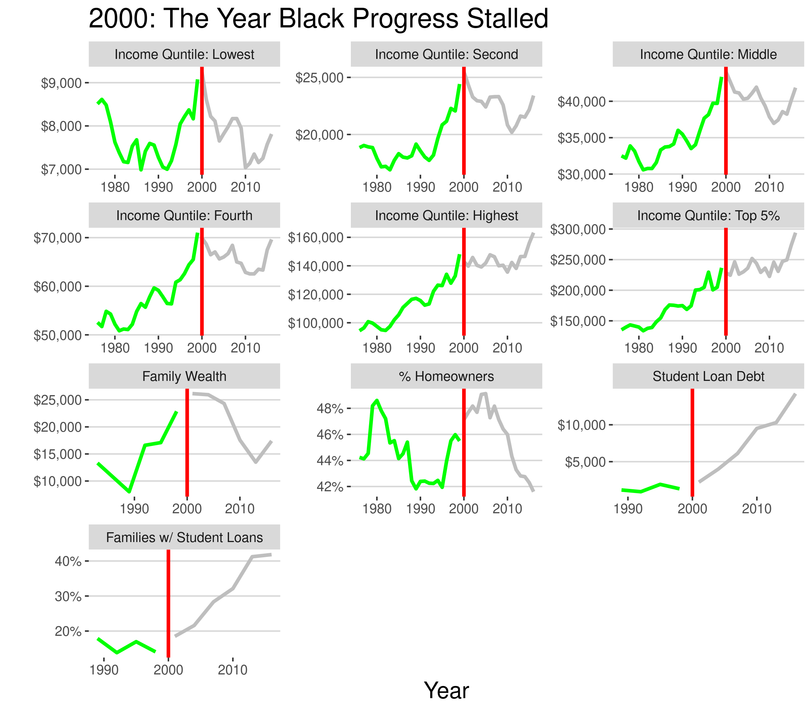

The data this week comes from the Urban Institute and the US Census. The Urban Institute lays out nine charts about racial wealth inequality in America. 

### Motivating question
How has black wealth and income progressed over time?

### Setup 
```{r setup, results='hide'}
knitr::opts_chunk$set(echo = TRUE)

sapply(c('tidyverse','tidytuesdayR','ggthemes','forcats'), require, character.only=T)
```

# Load the weekly Data

Download the weekly data and make available in the `tt` object.

```{r Load, eval = interactive()}
# load tidytuesday data
tt <- tt_load("2021-02-09")
tt
```

To answer the motivating question, create a subset of data for black people and save to the local directory:

```{r subset, eval=FALSE}
#format data to match the other dfs
wealth <- tt$race_wealth %>% 
  filter(type=='Median') %>% select(-type)
inc <- tt$income_mean %>% 
  filter(dollar_type=='2019 Dollars', !grepl('Combination', race)) %>% 
  select(-dollar_type) %>% 
  mutate(race = gsub(' Alone','',race)) %>% 
  # resolve data error
  distinct(year, race, income_quintile, .keep_all = T) %>% 
  pivot_wider(names_from=income_quintile, values_from=income_dollars, 
    names_prefix = 'Income Quntile: ')

# disaggregate the list into a single dataframe
byvars <- c('year','race')
tt_df_wide <- left_join(tt$home_owner, tt$student_debt, by=byvars) %>% 
  left_join(inc, by=byvars) %>% 
  left_join(wealth, by=byvars) 

tt_df <- pivot_longer(tt_df_wide, -c(year, race)) %>% 
  # remove NA values that didn't join
  filter(!is.na(value))

# filter dataframe to only black people
tt_df_black <- filter(tt_df, race=='Black')

#write to local directory
write_csv(tt_df_black, 'black_stats.csv')
```

## Glimpse Data

Take an initial look at data

```{r Glimpse}
black_stats <- read_csv('black_stats.csv', col_types = cols())
glimpse(black_stats)
```

## Prepare Data for Charts

I create a function to differentiate dollar/percent scales, and then convert the categories of income and wealth to a factor to preserve order.

```{r}
# axis label function
stat_scales <- function(x){
  if(mean(x, na.rm=T) < 1) d <- scales::percent(x, accuracy=1)
  else d <- scales::dollar(x)
  return(d)
}

black_stats_chart <- black_stats %>% 
  mutate(color = ifelse(year<2000, 'green','gray'),
    namefac = factor(name, levels = c("Income Quntile: Lowest","Income Quntile: Second" ,
    "Income Quntile: Middle", "Income Quntile: Fourth","Income Quntile: Highest",
    "Income Quntile: Top 5%", "wealth_family","home_owner_pct","loan_debt","loan_debt_pct")),
    # rename values as needed
    namefac = fct_recode(namefac, "Family Wealth"="wealth_family",
      "% Homeowners"="home_owner_pct",
      "Student Loan Debt"="loan_debt","Families w/ Student Loans"="loan_debt_pct")
  ) 
```

### Visualize

Display each of the indicators in its own facet. On a cursory glance, it becomes apparent that the year 2000 was an inflection point in most of the data.

```{r}
p <- ggplot(black_stats_chart, aes(x=year, y=value, col=year<2000)) +
  geom_line(size=1.2) +
  geom_vline(xintercept=2000, col='red', size=1.2)+
  scale_color_manual(values=c('gray','green'), guide=F)+
  scale_y_continuous(labels = stat_scales, breaks=scales::pretty_breaks(n=3)) +
  facet_wrap(vars(namefac), scales='free', nrow=4) +
  theme_hc() +
  theme(
    title=element_text(size=16),
  ) +
  labs(title = "2000: The Year Black Progress Stalled", x='Year',y='')
p
```

### Save Image

```{r eval=interactive()}

# This will save your most recent plot
ggsave(p,
  filename = "black_wealth_tt.png",
  width=8, height=7,
  device = "png")

```
