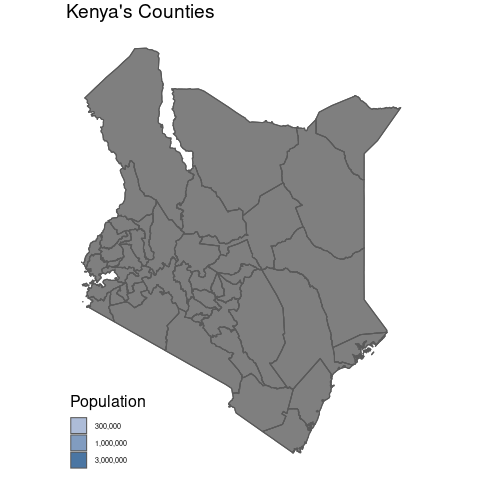

A quick demonstration of affline transformations with the Kenya Census

## Data Source

Thanks as always to the TidyTuesday crew at R4DS.

The data this week comes from rKenyaCensus courtesy of Shelmith Kariuki. Shelmith wrote about these datasets on her blog.

>rKenyaCensus is an R package that contains the 2019 Kenya Population and Housing Census results. The results were released by the Kenya National Bureau of Statistics in February 2020, and published in four different pdf files (Volume 1 - Volume 4).

>The 2019 Kenya Population and Housing Census was the eighth to be conducted in Kenya since 1948 and was conducted from the night of 24th/25th to 31st August 2019. Kenya leveraged on technology to capture data during cartographic mapping, enumeration and data transmission, making the 2019 Census the first paperless census to be conducted in Kenya

Additional details about Kenya can be found on Wikipedia.

>Kenya, officially the Republic of Kenya (Swahili: Jamhuri ya Kenya), is a country in Eastern Africa. At 580,367 square kilometres (224,081 sq mi), Kenya is the world's 48th largest country by total area. With a population of more than 47.6 million people in the 2019 census, Kenya is the 29th most populous country. Kenya's capital and largest city is Nairobi, while its oldest city and first capital is the coastal city of Mombasa.

# Load the weekly Data


```{r setup, resutls='hide', message=FALSE}
knitr::opts_chunk$set(echo = TRUE, message=F)
sapply(c('tidyverse','tidytuesdayR','here','ggplot2','ggthemes','rKenyaCensus','sf',
  'gganimate'), require, character.only=T)
knitr::opts_knit$set(root.dir = here())
```


Dowload the weekly data and make available in the `tt` object. Use the rKenyaCensus to do so, adding the polygons for each county.

```{r download, eval=FALSE}
# grab 3 tables of interest
crops <- rKenyaCensus::V4_T2.21
gender <- rKenyaCensus::V1_T2.2
households <- rKenyaCensus::V1_T2.3
counties <- rKenyaCensus::KenyaCounties_SHP %>% 
  st_as_sf %>% st_transform(4326)

# write them out
households %>% 
  write_csv("_tidytuesday/2021-01-19-tidy-tuesday/households.csv")

gender %>% 
  write_csv("_tidytuesday/2021-01-19-tidy-tuesday/gender.csv")

crops %>% 
  write_csv("_tidytuesday/2021-01-19-tidy-tuesday/crops.csv")

st_write(counties, "_tidytuesday/2021-01-19-tidy-tuesday/counties.geojson", delete_dsn = T)
```

```{r Readme, eval = interactive(), include=FALSE}
tt <- tt_load("2021-01-19")
tt


tt %>% 
  map(glimpse)
```

After saving, load from the directory directly:

```{r Load}
households <- read_csv("_tidytuesday/2021-01-19-tidy-tuesday/households.csv")
gender <- read_csv("_tidytuesday/2021-01-19-tidy-tuesday/gender.csv")
crops <- read_csv("_tidytuesday/2021-01-19-tidy-tuesday/crops.csv")
counties <- st_read("_tidytuesday/2021-01-19-tidy-tuesday/counties.geojson")

```


# Glimpse Data

Take an initial look at the format of the data available.


```{r}
head(counties)
head(gender)
```


# Wrangle

Transform country size based on population, then append to the existing dataset. The polygon transformation is conducted in `county_size`.

```{r Wrangle}
centroids <- counties %>% st_geometry %>% 
  st_transform(3857) %>% st_centroid %>% st_transform(4326)

county_form <- transmute(counties, county=tools::toTitleCase(County), population=as.numeric(Population), 
  pop_scale=scales::rescale(population, c(0.01,1)), centroid = centroids, type='Colored'
  ) %>% st_set_crs(4326)

# shift sizes around centroids
county_size <- mutate(county_form, geometry = (geometry-centroid)*pop_scale+centroid,
  type='Sized') %>% st_set_crs(4326) 

# replicate the original shape with NA for population so the color fill can animate
county_blank <- mutate(county_form, population = NA, type='Default')

# bind together for gganimate so I can switch between fill states
county_anim <- bind_rows(county_blank, county_form, county_size) %>% 
  mutate(type = factor(type, c("Default",'Colored','Sized')))
```


# Visualization

How is Kenya's population distributed across counties? Resize the polygons from 1% to 100% of original size based on the population size. Gif included at the top; this is the code that generated it.

```{r narrow_data, eval=FALSE}
anim <- ggplot(county_anim) +
  geom_sf(aes(fill=population)) +
  # animation specs
  transition_states(
    type, transition_length=1, state_length = 2
  )+
  ease_aes('cubic-in-out')+
  enter_fade()+
  # back to ggplot; add counties with no fill so outlines stay consistent
  geom_sf(data=counties, fill=NA) +
  scale_fill_steps(n.breaks=4, low="#bdc9e1", high="#045a8d", labels=scales::comma,
    guide='legend', trans='log10') +
  labs(title="Kenya's Counties", fill='Population') +
  theme_map() +
  theme(
    title=element_text(size=16, color='black')
  )
  
animate(anim, nframes = 20)

```


# Save
```{r eval=FALSE}
anim_save('_tidytuesday/2021-01-19-tidy-tuesday/kenya_county_size.gif', anim)
```

# Review

An obvious limitation to this approach is that a polygon can only go up to 100% of its original size without exceeding its original boundaries. In this map, the smallest county has the largest population, so the visual impact of the shifts is really messy. A possible cleanup strategy would be to make the original polygons to make them smaller, and so that the population-scaled polygons could increase to fit to the original boundaries.